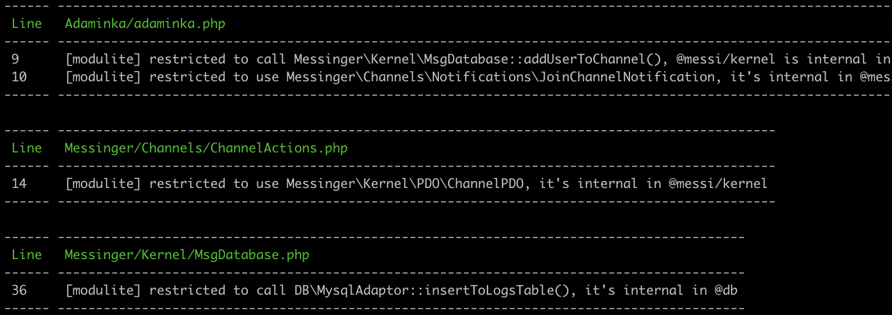

# Modulite plugin for PHPStan

Modulite is a conception that **brings modules into the PHP language**.
PHP does not have native modules (internal classes, private namespaces, explicit exports), 
and Modulite tries to eliminate this drawback.

Actually, all "modularity" is represented as `.modulite.yaml` files, which declare exports and requires. 
There is a PHPStorm plugin that deeply integrates into an IDE, visualizes yaml config and provides actions to modify it.

This PHPStan plugin reads `.modulite.yaml` files and fires errors if your code breaks modularity. 
That allows you to check a whole project in Git hooks, in CI, etc.

**Tip**. If you are unfamiliar with Modulite, consider a [PHPStorm plugin](https://github.com/VKCOM/modulite)
and a [landing page (in Russian)](https://vkcom.github.io/modulite/).


## Installation and configuration

To install, just use Composer:
```bash
composer require --dev vkcom/modulite-phpstan
```

After installing, include the plugin in your `phpstan.neon` and pass 2 parameters:
```
parameters:
    modulite:
        projectRoot: path    # project root is where composer.json/composer.lock/vendor exist
        srcRoot: path        # typically, projectRoot/src ; .modulite.yaml files will be searched recursively

includes:
    - vendor/vkcom/modulite-phpstan/extension.neon
```


## Example project

Clone [modulite-example-project](https://github.com/VKCOM/modulite-example-project), run `composer install`, 
run `vendor/bin/phpstan analyze`, and see some errors. 

The example intentionally contains some errors :) Also, it describes several steps of making its code perfect.



You can use Modulite while developing Composer packages, too. Moreover, you can control which symbols
are exported from your package. That ability is covered in [documentation](https://github.com/VKCOM/modulite).


## How the plugin works

As expected, *modulite-phpstan* analyzes function calls, class usages, PHPDocs, etc., 
and ensures that your code fits `export`, `require`, and other Modulite rules.

We advise you to use PHPStorm while development, because PHPStorm's plugin smoothly integrates into an IDE,
producing `.modulite.yaml` files, which are analyzed by *modulite-phpstan*.

Typically, a project structure is the following:
```text
my_project/     # projectRoot
    src/        # srcRoot
    tests/
    vendor/
    composer.json
```

When PHPStan starts analyzing your code, this plugin 
* locates all `.modulite.yaml` inside `{srcRoot}` 
* locates all `.modulite.yaml` and `composer.json` files inside `{projectRoot}/vendor`

The plugin has to scan `vendor`, because Composer packages are also checked to be required, etc.
Moreover, a package can also be developed using Modulite and contain private symbols, 
so when embedded into your project, the plugin would check against their usages also.

Modulite files are parsed, resolved and validated once PHPStan runs. 
In case they contain no errors, all modularity checks will be performed. 
Otherwise, yaml errors are dumped and no checks are performed.


## Composer packages outside vendor dir

In rare situations, you may be developing Composer packages locally, in the same repo. 
Being installed to `vendor`, they are just symlinked:
```text
my_project/     # projectRoot
    src/        # srcRoot
    packages/   # additionalPackagesRoot
        utils-common/
            src/
            composer.json
    tests/
    vendor/
        doctrine/
        phpstan/
        utils/
            common/   (symlink to packages/utils-common)
    composer.json     (contains "repositories" type "path" into packages/*)
```

In such cases, PHPStan's internal reflection discovers some classes in `packages/`, which are expected to be in `vendor/`
from the Modulite's point of view. Without additional hints, Modulite will produce errors, thinking `vendor/` uses
files out of scope. 

To overcome this problem, pass `additionalPackagesRoot` parameter besides `srcRoot`. 
Then *modulite-phpstan* will also scan that directory and create necessary path mappings.


## A sad note about PHPStan cache

If a PHP file is unchanged, PHPStan doesn't run analysis within it. It caches files state and errors, and just dumps them out, it analyzes only diff and changed dependencies.

As appears from the above,
* when PHP code is unchanged, but `.modulite.yaml` files are changed via PHPStorm plugin, no checks will be run
* when bits of PHP code are changed and `.modulite.yaml` files are changed also, PHPStan will run checks only for changed files, and dump previous (cached) errors for unchanged files, though unchanged files may contain no errors after yaml modification

For now, a 100% working advice is to clear cache from time to time:
```bash
vendor/bin/phpstan clear-result-cache
```

That will make PHPStan analyze a whole project, and the plugin will work as expected.

Probably, this may be fixed using some deep knowledge of PHPStan cache internals, how to embed into it and how to tell PHPStan about PHP<->yaml interconnection. If you are experienced in writing plugins, give a suggestion in [this issue](https://github.com/VKCOM/modulite-phpstan/issues/1).


## Limitations

* If you have unexpected behavior, try clearing PHPStan cache (a section above).
* `vendor/` dir is scanned recursively every run, which may take noticeable time; this can be improved, vote for [this issue](https://github.com/VKCOM/modulite-phpstan/issues/2).
* `projectRoot` and `srcRoot` parameters are required, but probably, they may be calculated automatically; if you are experienced in writing plugins, add a comment for [this issue](https://github.com/VKCOM/modulite-phpstan/issues/3).
* Only static method calls are analyzed, `$obj->method()` are not, that's why instance methods can't be added to `force-internal`. It's intentional, because static calls are resolved unambiguously, whereas instance calls rely on type inferring, which would certainly differ between IDE and PHPStan; static calls and class usages are more than enough, actually. 


## Contributing notes

Keep in mind, that all logic of Modulite behavior must be equal in 3 places:
* Modulite in [PHPStorm](https://github.com/VKCOM/modulite); checks are represented as IDEA inspections, symbols resolving also rely on PHPStorm internals.
* Modulite in PHPStan (this repo).
* Modulite in [KPHP](https://github.com/VKCOM/kphp); KPHP is a PHP compiler invented in VK; moreover, initial implementation of modules was made for KPHP+PHPStorm combination, and later the same logic was exposed as a PHPStan plugin to be used in regular PHP projects; lots of code related to yaml validation and rules checking are ported from the C++ implementation and must be kept in sync with KPHP, to remain sustainable.

If you find a bug, it's either a specific bug related to PHPStan peculiarities, or it may be a bug that also exists in other implementations and should be fixed simultaneously. If you have a feature request, it must be implemented in three repos at the same time, covered with the same tests, also. So, feel free to file issues, we'll find a way to manage them.

If you are experienced in PHPStan internals, and you have some advices to make this plugin more canonical, we'd be glad to see your comments and PRs.


## Ask questions and provide feedback

This plugin was developed by the KPHP Team at VK.com.

To communicate with our community, use GitHub issues or a [Telegram chat](https://t.me/kphp_chat).
